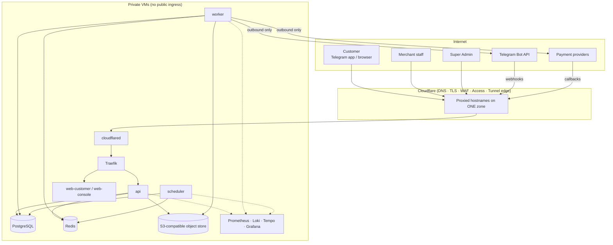

# 01 — Architecture

Status: **Proposed, awaiting approval** · Owner: CTO · Related: `20_DECISIONS.md` (ADR-001…025)

## 1. What we are building

A **Telegram-first, multi-tenant, blueprint-driven Commerce Operating System**. It is one platform core that runs thousands of independent merchant businesses across many verticals, controlled from one Super Admin console.

```
PLATFORM  →  VERTICAL  →  BLUEPRINT (versioned)  →  TENANT/MERCHANT  →  BOT + MINI APP  →  CUSTOMER
                                                        │
                                   ORDER → PAYMENT → LEDGER → PAYOUT → DELIVERY → REVIEW → ANALYTICS → AI → ADS
```

Three levels (directive §2):

| Level | Owns | Changes how |
|---|---|---|
| **Platform** | Identity, tenancy, blueprint engine, provisioning, payments, ledger, notifications, search, AI, analytics, audit, infrastructure | Code releases (shared by all) |
| **Vertical** | A blueprint *family*: entities, attributes, forms, workflows, rules, commission defaults, templates, AI and analytics config | Blueprint versions (data, not code) |
| **Merchant** | An isolated business instance pinned to one blueprint version: its customers, catalog, orders, money, staff, branding, bot and Mini App | Tenant configuration (data) |

## 2. Architectural style

**Modular monolith, one image, several process roles** (ADR-001). The code is split into modules with hard boundaries: each module owns its tables, exposes a Python interface, and publishes events. Nothing is split into separately deployed services until a measured operational reason exists (directive §97).

| Process role | Runs | Scales by |
|---|---|---|
| `api` | All HTTP: storefront API, console APIs, runtime manifest, and Telegram and payment webhooks | Replicas behind Traefik |
| `worker` | Outbox dispatcher, event consumers, notifications, image processing, provisioning sagas, and AI jobs | Replicas; queue partitions per tier |
| `scheduler` | Reconciliation, tenant health, payout batches, usage metering, and retention | Single active instance (leader lock) |
| `migrate` | One-shot Alembic migrations, before rollout | — |
| `web-customer` / `web-console` | Static builds of the two frontend bundles (see §6) | Cloudflare cache + replicas |

A module is extracted into its own deployable only when there is a measured reason: an independent scaling need, a failure-isolation need, or an enterprise isolation tier. Because modules already talk through interfaces and events, extraction does not require a rewrite.

## 3. System context



All traffic enters through Cloudflare → Tunnel → Traefik. Nothing inside `Private` publishes a port to the internet (`05_DOMAIN_AND_TUNNEL.md`).

## 4. The Platform Control Plane (directive §77)

Every request passes through the same resolution pipeline before any domain code runs:

```
Request
  → Edge context        request_id, trace_id, client IP (CF-Connecting-IP), host
  → Identity            session / Telegram initData (HMAC + Ed25519) / service token
  → Tenant resolver     host → domain table | bot route key → bot | console session → membership
  → Vertical resolver   tenant → vertical
  → Blueprint resolver  tenant → pinned blueprint_version (compiled, cached)
  → Plan & flags        plan entitlements, feature flags (platform → vertical → tenant → user)
  → Authorization       scoped RBAC: principal × permission × scope
  → DB session          SET LOCAL app.tenant_id / app.principal_id  (RLS)
  → Domain service      module call
  → Outbox              events written in the same transaction
```

The pipeline produces an immutable `RequestContext` that every module receives. **No module reads a tenant id from request input**; it only ever gets one from `RequestContext` (`02_TENANCY.md` §4).

## 5. Module map (engines)

| Plane | Module | Owns | Phase |
|---|---|---|---|
| Control | `identity` | persons, identities (Telegram/web/…), sessions, MFA, devices | 1 |
| Control | `tenancy` | organizations, tenants, merchants, memberships, placement, lifecycle | 1 |
| Control | `rbac` | roles, permissions, scoped assignments, support-access grants | 1 |
| Control | `audit` | append-only audit events | 1 |
| Control | `flags` · `plans` | feature flags, plans, entitlements, quotas, usage meters | 1 / 3 |
| Control | `blueprint` | verticals, attribute library, blueprints, versions, migrations, rule engine | 2 |
| Control | `provisioning` | Business Factory sagas, validation, activation | 3 |
| Control | `edge` | domains, Cloudflare DNS/Tunnel provider, hostname verification | 3 |
| Control | `telegram` | bots, managed-bot factory, Mini App config, webhook multiplexer | 4 |
| Commerce | `catalog` · `inventory` · `search` | listings, variants, stock, search projection | 5 |
| Commerce | `workflow` | state-machine runtime driven by blueprint definitions | 2 / 6 |
| Commerce | `orders` · `customers` | carts, orders, order state, customer records per tenant | 6 |
| Finance | `payments` | payment intents, attempts, provider adapters, provider-event inbox | 7 |
| Finance | `ledger` · `commissions` · `payouts` · `reconciliation` | double-entry ledger, rules, settlements | 8 |
| Engagement | `notifications` | templates, channels (Telegram, SMS, email, in-app), preferences | 9 |
| Engagement | `reviews` · `promotions` · `referrals` | eligibility, coupons, campaigns, attribution | 10 |
| Commerce | `delivery` | zones, pricing, couriers, proof of delivery | 11 |
| Intelligence | `ai` | AI gateway, tool registry, budgets, conversation and action logs | 12 |
| Intelligence | `analytics` · `trust` · `risk` | event facts, KPIs, trust signals, risk signals | 13 |
| Engagement | `advertising` | placements, sponsored search, billing | 14 |
| Support | `support` | tickets, disputes, escalation | 11+ |

**Module rules:**

1. A module writes only its own tables.
2. Cross-module reads go through the owning module's query interface, or through read models fed by events.
3. Cross-module writes go through commands or events, never another module's tables.
4. An import-linter contract in CI enforces these boundaries.

## 6. One frontend runtime (directive §9, §81)

One TypeScript codebase is built into **two bundles**. It is never built per merchant.

| Bundle | Served on | Audience | Why separate |
|---|---|---|---|
| `customer` | `{slug}.DOMAIN` (web + Telegram Mini App) | Customers | It must be small and fast inside the Telegram WebView, and it renders merchant-supplied content, so it must never share an origin with staff sessions. |
| `console` | `admin.`, `finance.`, `merchant.DOMAIN` | Super Admin, vertical admins, merchant staff | Heavy tables, forms and charts. Permission-gated screens. |

At start-up, each bundle fetches a **Runtime Manifest** from `GET /api/v1/runtime/manifest`, which the server resolves from the host and session. It contains:

- tenant, vertical and blueprint version (compiled views, forms, filters and workflow UI)
- theme tokens and branding
- locale bundles
- feature flags and permissions

The UI then renders from a registry of field and block components. A phone store and a car store are the same code running different manifests.

## 7. Planes and data placement (ADR-003)

| Plane | Postgres schema (Phase 1: one database) | Contains | Placement |
|---|---|---|---|
| Control | `control` | Everything needed to *route and authorize*: tenants, domains, bots, blueprints, users, roles, plans, flags, audit | Always the platform database |
| Commerce (tenant data) | `commerce` | Catalog, customers, orders, workflow instances, reviews, promotions | Shared (Starter), dedicated database (Pro), or dedicated cluster (Enterprise) |
| Finance | `finance` | Payment intents, provider events, ledger, payouts, commissions, reconciliation | Always the platform finance database, so money is never split |
| Ops | `ops` | Outbox, inbox, jobs, idempotency records | Co-located with the plane that writes them |

**Invariant:** no SQL join ever crosses planes. Cross-plane data moves through events or through module interfaces. This rule is what makes the Pro and Enterprise isolation tiers a *placement* change rather than a rewrite (`02_TENANCY.md` §3).

## 8. Technology choices (summary; rationale in ADRs)

| Concern | Choice | ADR |
|---|---|---|
| Backend | Python 3.13+, FastAPI, Pydantic v2, SQLAlchemy 2 Core over asyncpg, Alembic | 004 |
| Frontend | TypeScript, React, Vite, pnpm workspaces | 005 |
| Telegram | aiogram 3 (multi-bot webhook), Bot API managed bots | 011 |
| Database | PostgreSQL 17+ with RLS | 002 |
| Cache, locks, rate limits | Redis 7 (non-authoritative) | — |
| Events | Transactional outbox in Postgres + inbox dedupe; a broker only when measured need arises | 016 |
| Object storage | S3 API; server product chosen after a licence/maintenance review | 019 |
| Search | Postgres full-text search + typed attribute projection behind `SearchPort`; OpenSearch later | 018 |
| Rules | JSONLogic, evaluated identically in the browser (UX) and on the server (authority) | 007 |
| Ingress | Cloudflare → cloudflared (container) → Traefik v3, all config in git | 010 |
| Observability | OpenTelemetry → Collector → Prometheus / Loki / Tempo → Grafana, with Alertmanager to a Telegram ops chat | 023 |
| Infra as code | Docker Compose, Ansible, Terraform (Cloudflare), cloud-init | 020 |
| CI/CD | GitHub Actions: build, test and scan on hosted runners; deploy pull-based on private infra | — |

## 9. Planned repository layout

```
arada/
├── docs/                      # this architecture package (00–20) + runbooks later
├── backend/
│   ├── pyproject.toml
│   ├── src/arada/
│   │   ├── kernel/            # Money, ids, RequestContext, errors, events/outbox, db session
│   │   ├── control/           # identity, tenancy, rbac, audit, flags, plans, blueprint, provisioning, edge, telegram
│   │   ├── commerce/          # catalog, inventory, search, workflow, orders, customers, delivery, reviews, promotions
│   │   ├── finance/           # payments (+ adapters/), ledger, commissions, payouts, reconciliation
│   │   ├── engagement/        # notifications, referrals, advertising
│   │   ├── intelligence/      # ai (gateway, tools), analytics, trust, risk
│   │   ├── extensions/        # vertical-specific logic, e.g. imei, vin, fitment (registered by key)
│   │   └── entrypoints/       # api.py, worker.py, scheduler.py, cli.py
│   ├── migrations/            # Alembic
│   └── tests/                 # unit/ integration/ isolation/ finance/ contract/ e2e/
├── frontend/
│   ├── apps/customer/         # Mini App + web storefront runtime
│   ├── apps/console/          # super admin, vertical admin, merchant portal, finance
│   └── packages/              # ui, runtime (manifest renderer), forms (JSONLogic), sdk (typed API client), i18n
├── blueprints/                # source-controlled seed blueprints: phones/v1.0.yaml, cars/…
├── infra/
│   ├── compose/               # dev, staging, prod compose files
│   ├── traefik/               # static + dynamic config (committed)
│   ├── cloudflared/           # config template (credentials never committed)
│   ├── ansible/               # host provisioning, hardening, deploy
│   ├── terraform/cloudflare/  # zone settings, WAF, Access apps, tunnel
│   └── observability/         # prometheus rules, grafana dashboards, loki, tempo, otel-collector
└── .github/workflows/
```

The directive suggested `services/<name>` directories. They are realised here as *modules* inside one backend package, so extracting one later is a packaging change, not a redesign.

## 10. The five questions every change must answer (directive §102)

| Question | Architectural answer |
|---|---|
| Easier or harder to create the 1,000th merchant? | Merchants are data rows plus provisioning sagas. There is no per-merchant code, image, database, VM or manual DNS work. |
| Can two tenants see each other's data? | Five layers: server-side tenant resolution, scoped RBAC, RLS, composite same-tenant foreign keys, and isolation test suites (`02`, `19`). |
| Can a payment callback happen twice? | Unique `(provider, provider_event_id)`, idempotency keys, monotonic state machines and ledger idempotency (`07`, `08`). |
| Can the origin be reached without Cloudflare? | No published ports and no inbound firewall rules. The tunnel is outbound-only. This is verified by an external scan in acceptance tests (`05`, `19`). |
| Can a blueprint change break existing merchants? | Published versions are immutable, and tenants stay pinned until an explicit, previewed and reversible migration (`03`). |
| Can one merchant create unlimited cost? | Plan quotas, AI budgets, rate limits and per-tenant usage meters (`14`). |
