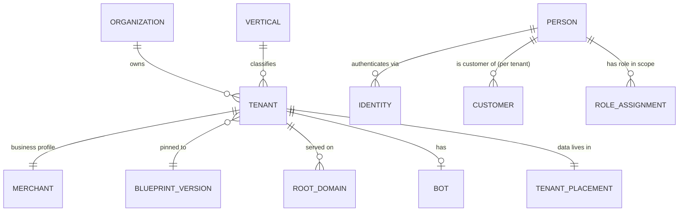

# 02 — Tenancy

Status: **Proposed** · Related: ADR-002, ADR-003, ADR-024 · Tests: `19_ACCEPTANCE_TESTS.md` §2

Tenant isolation ranks #2 in the priority order, after correctness. If there is any doubt, the architecture must fail closed.

## 1. Vocabulary

| Term | Meaning |
|---|---|
| **Organization** | The legal or commercial owner, such as a person or company. It can own several tenants, for example two shops. It is used for consolidated billing and owner login. |
| **Tenant** | **The isolation boundary.** Every tenant-owned row carries `tenant_id`, and every authorization and RLS decision keys on it. |
| **Merchant** | The business profile of a tenant: name, brand, vertical, blueprint pin, bot, Mini App and storefront. It is **1:1 with a tenant.** "Merchant" is the business view and "tenant" is the security view of the same thing. |
| **Vertical** | A business category, such as Phones or Cars. Tenants belong to exactly one vertical. |
| **Person** | A human, global across the platform (see §6). |
| **Customer** | A person *as seen by one tenant*. Each tenant has its own customer record, so a merchant never sees what the same person does at another merchant. |
| **Member** | A person with a role in a scope (platform, vertical or tenant). Staff are members. |



## 2. Tenant lifecycle

```
draft ─► provisioning ─► validating ─► ready ─► active ◄──► suspended
  │           │               │                    │              │
  └─ cancel   └─ failed ◄─────┘                    └─► offboarding ─► archived ─► purged (after retention)
                 (retry / rollback)                        maintenance (flag, not a state)
```

| State | Customer-facing | Staff access | Money |
|---|---|---|---|
| `draft` | none | Super Admin only | none |
| `provisioning` / `validating` / `failed` | none (DNS not yet live) | Super Admin | none |
| `ready` | Preview only: bot access restricted to allow-listed testers, and the domain is live but not indexed | owner + staff | test mode only |
| `active` | live | normal | live |
| `suspended` | Storefront shows a notice; checkout is disabled; the bot sends a notice | read-only (finance export allowed) | Inbound payments blocked. Refunds and payouts are allowed, and they require approval. |
| `offboarding` | disabled | Export only | Final settlement, then payable balance must reach zero |
| `archived` | disabled; DNS removed | none | Ledger retained, because financial records are immutable |

Every transition is a command, is audited, and emits `TenantStateChanged`. **A tenant cannot claim "healthy"**; health is computed separately (`12_OBSERVABILITY.md` §5).

## 3. Isolation tiers and placement (directive §7)

The tier is a **placement decision recorded in data**, not a code fork.

| Tier | Commerce plane | Finance plane | Compute | Default for |
|---|---|---|---|---|
| **Starter** | Shared database, shared schema, RLS | Platform finance database | Shared workers | FREE / STARTER / PRO plans |
| **Pro** (isolated) | **Dedicated database** on the shared Postgres cluster (same schema, same migrations) | Platform finance database | Shared workers, dedicated queue partition, higher quotas | BUSINESS plan, or on request |
| **Enterprise** | **Dedicated Postgres cluster** (another VM) | Platform finance database | Optional dedicated worker pool; optional dedicated `api` replicas via host routing | ENTERPRISE plan |

`control.tenant_placement(tenant_id, tier, commerce_dsn_ref, database_name, worker_pool, migrated_at)` records where each tenant's commerce data lives. `commerce_dsn_ref` points at a secret and is never a literal DSN.

- The **data-plane router** (`kernel.db`) chooses the connection pool from the placement row. Module code never knows which tier it is running on.
- **Schema-per-tenant is rejected.** It multiplies migration runs and catalog bloat without giving the failure isolation that database-per-tenant gives.
- **Tier migration** (Starter → Pro) is a per-tenant job:
  1. Logical copy of the tenant's rows (`WHERE tenant_id = …`) into the new database.
  2. Brief write freeze for that tenant only (maintenance flag).
  3. Delta sync.
  4. Placement switch.
  5. Verify: row counts and checksums per table.
  6. Delete source rows after a retention window.
- Finance **never moves**. Keeping the ledger in one place keeps platform-wide reconciliation a single-database operation.

## 4. Tenant resolution: never from the client

`X-Tenant-ID` and any tenant id in a body or query string are **ignored for authorization**. Resolution sources, by surface:

| Surface | Trusted source | Binding check |
|---|---|---|
| Storefront / Mini App (`{slug}.ROOT_DOMAIN`) | `Host` header → `control.domains` (normalised: lower-case, IDNA, no port, no trailing dot) → tenant | Tenant must be `ready` or `active`, and the domain must be `active`. For Telegram sessions, `initData` must validate against **this tenant's** bot, and its `bot_id` must equal the tenant's bot (`04` §5). |
| Telegram webhook (`api.ROOT_DOMAIN/tg/wh/{route_key}`) | `route_key` (random, 32 bytes) → bot → tenant | `X-Telegram-Bot-Api-Secret-Token` must equal that bot's secret (constant-time comparison) |
| Payment webhook (`api.ROOT_DOMAIN/pay/wh/{provider}/{config_key}`) | `config_key` → payment configuration → tenant | Provider signature verified with that configuration's credentials. The amount and reference must match an existing intent of that tenant. |
| Console (`merchant.ROOT_DOMAIN`) | Server-side session → person → memberships | A path `/t/{tenant_slug}/…` is a *request* to act in that tenant and is authorized against memberships. The active tenant is stored in the server session. |
| Console (`admin.` / `finance.`) | Session + platform or vertical scoped roles | Vertical admins are filtered to their verticals; cross-vertical access needs an explicit grant. |
| Internal jobs | Tenant id carried in the event envelope or job payload, written by the server | Consumers re-establish `RequestContext` with `principal = system:<job>` and `SET LOCAL app.tenant_id` |
| Resource links (`startapp=p_…`, order links) | Opaque token resolved **inside** the already-resolved tenant | A product token from tenant A presented on tenant B's host resolves to *not found*, not a redirect |

Unknown hosts return **404 with a generic body**. Negative lookups are cached for 60 s and rate-limited, so random-subdomain probing cannot hammer the database.

## 5. Defense in depth: five independent layers

1. **Server-side resolution** (§4). This is the only way into `RequestContext.tenant_id`.
2. **Scoped RBAC** (`10_RBAC.md`). The permission check includes the scope.
3. **PostgreSQL Row-Level Security** on every tenant table:

   ```sql
   ALTER TABLE commerce.listings ENABLE ROW LEVEL SECURITY;
   ALTER TABLE commerce.listings FORCE ROW LEVEL SECURITY;          -- owner is subject too
   CREATE POLICY tenant_isolation ON commerce.listings
     USING      (tenant_id = NULLIF(current_setting('app.tenant_id', true), '')::uuid)
     WITH CHECK (tenant_id = NULLIF(current_setting('app.tenant_id', true), '')::uuid);
   ```

   - The application connects as `arada_app` (`NOBYPASSRLS`, not the owner). Migrations run as `arada_owner`.
   - The tenant is set with `SET LOCAL` **inside each transaction**, so a pooled connection can never carry a previous request's tenant. This is also safe with PgBouncer in transaction mode.
   - If the setting is missing, the policy compares against NULL and returns **zero rows**. It fails closed.
   - Platform-wide reads, such as Super Admin reporting and reconciliation, use a **separate pool** as role `arada_platform_reader` (`BYPASSRLS`, **read-only**). Only modules on an allow-list may use it, and CI checks that allow-list. There is no writable bypass role at runtime.
4. **Database constraints.** Every tenant table has `UNIQUE (tenant_id, id)`, and child tables use **composite foreign keys**:

   ```sql
   FOREIGN KEY (tenant_id, order_id) REFERENCES commerce.orders (tenant_id, id)
   ```

   With this, an order item cannot point at another tenant's order, even through a bug that bypasses RLS.
5. **Tests.** Every tenant-scoped endpoint is enumerated from the OpenAPI spec and attacked cross-tenant in CI (`19` §2). A new endpoint without an isolation test fails the build.

**Also:**

- Caches are keyed by `tenant_id` and use a key builder that refuses to build a key without one.
- Object-storage keys are prefixed `t/{tenant_id}/`, and signed URLs are scoped to the prefix.
- Search documents carry `tenant_id` as a mandatory filter inside `SearchPort`, not as a caller option.
- Analytics facts carry `tenant_id`, and merchant-facing analytics queries go through the same RLS.

## 6. Identity and customers (directive §59–60)

```
control.persons              (id, display_name, locale, created_at, status)
control.identities           (id, person_id, provider, subject, verified_at, metadata)   UNIQUE(provider, subject)
                              provider ∈ telegram | phone | email | web_passkey | …
commerce.customers           (tenant_id, id, person_id, first_seen_at, marketing_consent, notes, …)  UNIQUE(tenant_id, person_id)
```

- On a first valid Telegram session in tenant T, the platform finds or creates the person by `(telegram, tg_user_id)`, then finds or creates `customers(T, person)`.
- Merchants see `commerce.customers` rows for their own tenant only. Contact details are shared with a merchant only when needed for fulfilment (for example, a delivery phone number captured at checkout with consent). The person's global profile is not exposed.
- Staff logins use the same `persons` and `identities`. Staff authenticate with passkey or password + TOTP, with Telegram as an optional second factor, never as the only factor for admin roles.

## 7. Platform access to tenant data

- **Super Admin and platform roles** can read tenant data through the platform reader, for platform-level functions. Each read of a tenant's sensitive records (customers, payments, staff) is audited with the requester and purpose.
- **Support access** to a tenant is **just-in-time**: a grant is scoped to one tenant with a reason, a ticket reference and an expiry (default 60 minutes), and is optionally approved by the tenant owner. Every request made under the grant is tagged in the audit log.
- **The AI gateway** acts with the invoking principal's context, never with the platform reader (`01` §5, directive §40).

## 8. Tenant configuration layering

The effective configuration is a layered merge, most specific last. It is computed and cached per `(tenant, config_version)`:

```
platform defaults  →  vertical defaults  →  blueprint version  →  plan entitlements  →  tenant overrides
```

Each layer is versioned. `tenant.config_version` increments on any change, which busts the runtime manifest cache (`ETag`). Secrets are never part of configuration; configuration only holds *references* to secrets (`09_SECURITY.md` §6).
