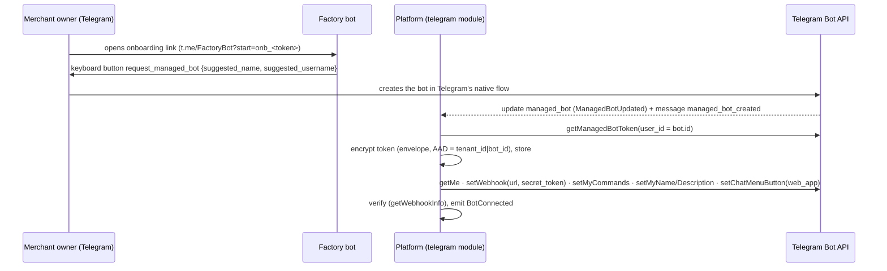

# 04 — Telegram Architecture

Status: **Proposed** · Related: ADR-011, ADR-012 · Phase 4 · Verified against the Telegram Bot API docs as of Bot API 10.3 (2026-08-24)

Telegram is the **first channel, not the backend** (directive §60). The `telegram` module is an adapter over channel-agnostic commerce modules. Nothing in `orders`, `payments` or `catalog` imports anything from Telegram.

## 1. Bot topology

| Bot | Owner | Purpose |
|---|---|---|
| **Factory bot** (one, platform-owned) | Super Admin's Telegram account | Merchant onboarding, creating merchant bots via **managed bots**, and merchant staff notifications. Has "management of other bots" enabled in the @BotFather Mini App. |
| **Merchant bots** (one per merchant) | See Q7: the merchant owner (managed bot) or the platform | The customer-facing identity: storefront Mini App, order updates, support chat |
| **Ops bot** (one, platform) | Super Admin | Alerts (Alertmanager), deploy notices, and approvals for sensitive actions |

## 2. Bot provisioning (directive §12)

### 2a. Preferred: managed bots (Bot API 9.6+)



- The **onboarding token** in `start=onb_…` is a single-use, 15-minute, server-issued reference to a pending provisioning run. It is never a tenant id.
- **Token rotation:** `replaceManagedBotToken(user_id)` revokes the old token and returns a new one, with no merchant involvement. Rotation runs on a schedule (default 90 days), on suspected compromise, and after any staff offboarding.
- **Access restriction while `ready`, before launch:** `setManagedBotAccessSettings(is_access_restricted=true, added_user_ids=[testers…])` lets owner and testers validate a store before it goes public. Lifting the restriction is part of the activation step.
- `managed_bot` updates also arrive when the **token or owner changes**. The platform treats an unexpected owner change as a security event: it suspends the bot binding and alerts.

### 2b. Fallback: bring your own bot

The merchant creates a bot in @BotFather and submits the token through the console (never in chat). The platform then:

1. Validates the token with `getMe`.
2. Confirms the bot has no conflicting webhook.
3. Encrypts and stores the token.
4. Configures the bot as in §2a.

The platform cannot rotate a BYO token itself, so rotation is a guided task for the merchant.

### 2c. What still requires @BotFather

The **Main Mini App** and **direct-link Mini Apps** (`t.me/bot/app`) must be configured in @BotFather, according to the Mini Apps documentation. The provisioning run records these as a **guided manual step**:

- It gives exact instructions and the URL `https://{slug}.DOMAIN/`.
- It verifies the result by opening the direct link in an automated check.
- It keeps the tenant in `validating` until the check passes.

The chat menu button is set by API (`setChatMenuButton` with `web_app`), so a merchant bot is usable even before the Main Mini App step is complete.

### Stored per bot (`control.bots`)

`id, tenant_id, telegram_bot_id, username, kind (managed|byo|platform), token_ciphertext, token_key_version, webhook_route_key (random 32 bytes, base64url), webhook_secret_ciphertext, webhook_state, last_webhook_check_at, last_error, commands_version, profile (name/description/short description per locale), mini_app_url, main_mini_app_verified_at, access_restricted, created_at, rotated_at`

Bot tokens are **never** sent to any frontend or log line, and never appear in any error message. The log redactor removes the pattern `\d{6,}:[A-Za-z0-9_-]{30,}`.

## 3. Webhook ingress: one endpoint for all bots

```
POST https://api.DOMAIN/tg/wh/{webhook_route_key}
Header: X-Telegram-Bot-Api-Secret-Token: <per-bot secret>
```

1. Look up the bot by `webhook_route_key`, which is an opaque random value, not the bot id, so it cannot be enumerated. If there is no match, return **404**.
2. Constant-time comparison of the secret header. If it does not match, return **401** and increment a metric; repeated failures trigger an alert.
3. Dedupe on `(bot_id, update_id)` in `ops.inbox`. Telegram retries until it receives a 2xx.
4. Persist the raw update and write a job **in the same transaction**, then return **200 immediately**. Handlers run in `worker`.
5. The handler builds `RequestContext(tenant = bot.tenant, principal = telegram:<user_id>)` and dispatches to channel-agnostic commands.

One aiogram 3 dispatcher serves all bots; the bot instance is chosen per update. **Outbound sends** go through the `notifications` module's Telegram channel, which runs a **per-bot token bucket** within Telegram's documented limits (roughly 1 message per second per chat and roughly 30 per second per bot for bulk sends) and a global concurrency cap. It handles 429 responses with `retry_after`.

**Health loop** (`scheduler`, every 5 minutes per active bot, jittered): `getWebhookInfo`.

| Condition | Action |
|---|---|
| URL mismatch | **Security alert.** Someone called `setWebhook` with our token. The platform restores the webhook, rotates the token, and alerts the Super Admin. |
| `last_error_date` is recent | Bot health = DEGRADED |
| `pending_update_count` above threshold | Bot health = DEGRADED; alert |

Results feed tenant health (`12` §5).

## 4. Mini App (directive §13)

- **URL:** `https://{slug}.DOMAIN/`. It is the same origin as the web storefront, so there is one runtime, and it uses the `customer` bundle.
- **Launch surfaces:**
  - Main Mini App (`t.me/{bot}?startapp=…`)
  - direct link (`t.me/{bot}/{app}?startapp=…`)
  - menu button
  - inline keyboard `web_app` buttons in bot messages
  - group or shared contexts where the vertical enables them
- **Theme:** Telegram `themeParams` and colour scheme are merged with merchant brand tokens from the manifest. Supported: fullscreen, safe areas, BackButton, MainButton and haptics.
- **Storage:** Telegram `DeviceStorage` / `SecureStorage` (Bot API 8.0+) may hold UX preferences only. **No authoritative state and no tokens live in client storage.** Access tokens are held in memory.

## 5. Authentication: `initData` validation (ADR-012)

The client sends the raw `Telegram.WebApp.initData` string to `POST /api/v1/auth/telegram` on its own tenant host. `initDataUnsafe` is **never** used for authentication or authorization; the client may use it for display only.

The server validates:

1. **Tenant first.** Resolve the tenant from the `Host`, and load that tenant's bot (and token) from the cache or database.
2. **HMAC (Telegram's documented algorithm).**
   - `secret_key = HMAC_SHA256(key="WebAppData", msg=bot_token)`
   - `data_check_string` = every received field except `hash`, sorted by key, formatted as `k=v` and joined with `\n`
   - Require `hex(HMAC_SHA256(key=secret_key, msg=data_check_string))` to equal `hash`, compared in constant time.
3. **Ed25519 `signature`.** This is defense in depth, and it is **new compared with the existing Bingo validator**.
   - `data_check_string' = "<bot_id>:WebAppData\n"` + all fields except `hash` and `signature`, sorted, `k=v`, joined with `\n`
   - Verify the base64url `signature` using Telegram's published Ed25519 public key (production and test keys are configured per environment).
   - *Why:* the HMAC proves the data was signed by someone holding the bot token. **Anyone holding the token, such as a BYO merchant or a leaked token, can forge HMAC-valid `initData` for any user.** The Ed25519 signature can only be produced by Telegram, so requiring it closes that impersonation path.
4. **Bot binding.** The `bot_id` used in step 3 must equal the resolved tenant's `telegram_bot_id`. Tenant B's host rejects `initData` from tenant A's bot.
5. **Freshness.**
   - `auth_date` must be within `MINIAPP_AUTH_MAX_AGE` (default **1 hour**, configurable) to *establish* a session.
   - Reject values more than 60 s in the future.
   - Replay protection: cache the `(bot_id, hash)` pair for the max-age window and reject a second session bootstrap from identical `initData` after 10 minutes. Re-opens within that window are allowed.
6. **Result.** Find or create the person and identity `(telegram, user.id)` and `customers(tenant, person)`. Issue a **tenant-bound access token** (JWT, EdDSA, 15 minutes; claims: `sub=person_id`, `tid=tenant_id`, `aud=customer`, `sid`) and a **refresh handle** (opaque, stored server-side, 12 hours, rotated on use, revocable).

When the refresh handle expires, the client re-exchanges the current `initData`, which remains available for the Mini App's lifetime. If that `initData` is older than the maximum age, the app asks the user to reopen it from the bot.

**Financial actions** (checkout confirmation, refunds, address changes for paid orders) also require the explicit confirmation flow described in `07` §4. No token alone can purchase anything.

**Web (non-Telegram) storefront:** a future identity provider, phone OTP, issues the same token shape. That is why identity is provider-agnostic (`02` §6).

## 6. Deep links and `startapp` (directive §13, §50)

`start_param` is **untrusted input**. Tokens are short, opaque and server-issued. They are kept to at most 64 characters from `[A-Za-z0-9_-]` so they also fit the stricter `start` parameter limit.

| Prefix | Meaning | Resolution |
|---|---|---|
| `p_<token>` | Product | `control.deeplinks(token) → (tenant_id, target)`. **Must equal the resolved tenant**, otherwise not found. |
| `o_<token>` | Order | Tenant match, **and** the order must belong to the authenticated customer, otherwise not found |
| `c_<code>` | Campaign | Campaign active in this tenant |
| `r_<code>` | Referral | Referral code issued by the server to a customer of *this* tenant |
| `m_<token>` | Merchant landing, for the future cross-merchant `app.DOMAIN` | Directory entry must be public |
| `onb_<token>` | Factory-bot onboarding | Single-use provisioning reference |

Referral attribution happens **server-side**:

- The referral is recorded at the first valid session for a customer who is new to that tenant.
- The first touch wins within the attribution window.
- Self-referral (same person) is rejected, and velocity limits apply per code.
- The client can *present* a code but cannot *assert* an attribution.

Rewards are released only on qualifying events such as a completed, unrefunded order past the return window (`16_THREAT_MODEL.md`).

## 7. Commands and messages

Per-tenant commands are rendered from blueprint and tenant configuration (`/start`, `/shop`, `/orders`, `/help`, `/language`). They are localised (`am`, `en`) and pushed with `setMyCommands` when `commands_version` changes. Message templates live in `notifications` (`01` §5). Templates are per tenant and locale, with blueprint defaults, rendered with a safe template engine (no attribute access and no code).

## 8. Failure modes

| Failure | Behaviour |
|---|---|
| Telegram API outage | Outbound sends queue with backoff. The storefront keeps working because web and Mini App traffic does not depend on the Bot API. |
| Webhook backlog | Workers autoscale up to a limit. Updates are processed in `update_id` order per chat, where ordering matters. |
| Bot token revoked by the owner | `getMe` returns 401, so bot health is OFFLINE. Alert the owner in the Factory bot and the Super Admin. The storefront keeps working on the web. |
| Merchant deletes the bot | Same as above, plus a guided re-link flow. The customer history is kept, because it is keyed to the person, not the bot. |
