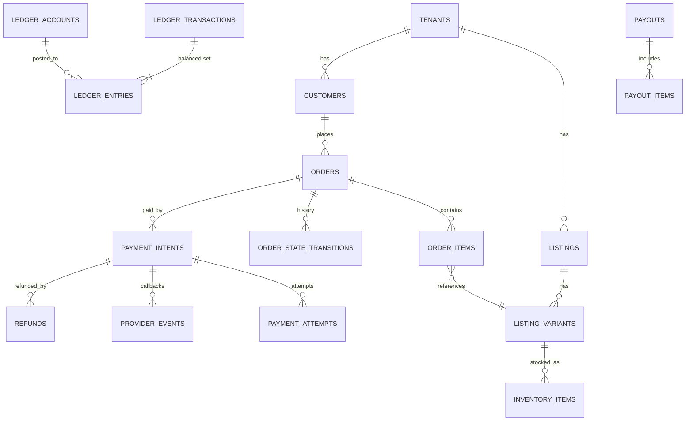

# 06 — Database and Domain Model

Status: **Proposed** · Related: ADR-002, ADR-003, ADR-013, ADR-022 · Engine: PostgreSQL 17+

> **As built in Phase 1 (2026-09-26):** a single schema, `control`, with 7 migrations. Tenant-owned rows under FORCE RLS: `merchant_profiles`, `tenant_memberships`, `tenant_membership_roles`, `tenant_invitations`, `tenant_invitation_roles` and `audit_events`. Memberships live in the control plane, not `commerce` (ADR-003 history). The runtime roles are those in §2 plus **`arada_resolver`** (NOLOGIN; owns the two cross-tenant resolver functions). Verticals use `name_en`/`name_am` columns rather than JSON. The `commerce`, `finance` and `ops` schemas are created with their first tables. The rest of this document is the target model.

## 1. Conventions (all tables)

| Rule | Detail |
|---|---|
| Primary keys | `id uuid`, **UUIDv7** (time-ordered, RFC 9562), generated in the application. This keeps index locality and works on any Postgres version. |
| Human references | Per-tenant sequences for things people read aloud: `ORD-26-000123`, `PAY-…`. Stored as `ref text`, with `UNIQUE (tenant_id, ref)`. |
| Tenant key | `tenant_id uuid NOT NULL` on every tenant-owned table, plus `UNIQUE (tenant_id, id)`. Children use **composite foreign keys** `(tenant_id, parent_id)`. |
| RLS | `ENABLE` + `FORCE ROW LEVEL SECURITY` with a `tenant_isolation` policy on every tenant table (`02` §5). A CI test fails if any table with a `tenant_id` column lacks the policy. |
| Money | `amount_minor bigint` + `currency char(3)` (ISO 4217). **No `float`, `real`, `double precision` or `money` column types anywhere**; CI checks the schema. Rates are `rate_bps integer` (basis points). |
| Timestamps | `created_at timestamptz NOT NULL DEFAULT now()`, `updated_at timestamptz`. Everything is stored in UTC and displayed in `Africa/Addis_Ababa` (or the tenant's time zone). The Ethiopian calendar is a display option, never a storage format. |
| Actor | `created_by uuid`, `updated_by uuid` (a person or `system` principal id) |
| Concurrency | `version integer NOT NULL DEFAULT 1` on mutable aggregates. Updates are `WHERE id=$1 AND version=$2`, exposed as `ETag` / `If-Match` in the API. |
| Soft delete | `deleted_at` **only** on catalog, content and staff-facing configuration. **Never** on finance, orders, audit or events; those are immutable or state-driven. |
| Immutability | The finance ledger, provider events, audit events and published blueprint versions are protected by triggers that reject `UPDATE`/`DELETE`, and the app role has only `INSERT, SELECT` on them. |
| Enumerations | `text` + `CHECK` constraints (evolvable by migration), not Postgres `ENUM` types, which are awkward to change |
| JSON | `jsonb` only for blueprint-defined attributes, raw provider payloads and configuration documents. Never for data the platform itself queries relationally. |
| Naming | `snake_case`. Tables are plural. Foreign keys are `<entity>_id`. Indexes are `ix_<table>__<cols>`. |

## 2. Database roles

| Role | Used by | Rights |
|---|---|---|
| `arada_owner` | `migrate` job only | Owns the schemas. Never used at runtime. |
| `arada_app` | `api`, `worker`, `scheduler` | DML on permitted tables, `NOBYPASSRLS`, no DDL |
| `arada_platform_reader` | Platform reporting and reconciliation modules on an allow-list | `SELECT`, `BYPASSRLS`, read-only (`default_transaction_read_only=on`) |
| `arada_backup` | pgBackRest | Replication and backup |
| `arada_readonly_ops` | Humans, break-glass | `SELECT` on non-PII views; logged |

## 3. Schemas and tables

### `control` (control plane)

| Table | Key columns | Notes |
|---|---|---|
| `platform_settings` | key, value jsonb, version | Singleton-ish configuration |
| `verticals` | id, key, name i18n, status, default_blueprint_id | |
| `attribute_definitions` | id, key, type, unit, validation jsonb, flags | Platform attribute library |
| `blueprints` | id, vertical_id, key, name | Blueprint family |
| `blueprint_versions` | id, blueprint_id, semver, status, definition jsonb, content_hash, published_at, published_by | Immutable once published |
| `blueprint_migration_plans` / `_runs` / `_log` | … | `03` §7 |
| `organizations` | id, legal_name, tin, owner_person_id, billing_account_id | |
| `tenants` | id, organization_id, vertical_id, slug UNIQUE, status, tier, blueprint_version_id, plan_id, config_version, region, timezone | The isolation root |
| `merchants` | tenant_id PK/FK, display_name i18n, brand jsonb (logo asset, colours), contact, legal info | 1:1 with a tenant |
| `tenant_placement` | tenant_id, tier, commerce_dsn_ref, database_name, worker_pool | `02` §3 |
| `tenant_config` | tenant_id, layer overrides jsonb, version | Non-secret configuration |
| `domains` | id, tenant_id NULL (platform hosts), hostname UNIQUE, kind (storefront/platform/redirect), status, dns_record_ref, verified_at | Host → tenant resolution |
| `bots` | see `04` §2 | Encrypted token |
| `mini_apps` | id, bot_id, short_name, url, main_app_verified_at | |
| `deeplinks` | token PK, tenant_id, target_type, target_id, expires_at, created_by | `04` §6 |
| `persons` · `identities` · `sessions` · `mfa_factors` · `devices` | … | `02` §6, `09` §3 |
| `roles` · `permissions` · `role_permissions` · `role_assignments(person_id, role_id, scope_type, scope_id)` · `access_grants` | … | `10_RBAC.md` |
| `plans` · `plan_entitlements` · `subscriptions` · `usage_counters` | … | `14` §5 |
| `feature_flags` · `flag_overrides(scope_type, scope_id)` | … | |
| `provisioning_runs` · `provisioning_steps` | run_id, tenant_id, step_key, status, attempt, output jsonb, error | `11` §6 |
| `deployments` · `releases` · `tenant_health` | … | `11`, `12` |
| `provider_credentials` | id, scope (platform/tenant), tenant_id, provider, ciphertext, key_version, rotated_at | Envelope-encrypted (`09` §6) |
| `integrations` · `webhook_subscriptions` | … | Outbound partner webhooks (future) |
| `audit_events` | id, at, actor_person_id, actor_type, tenant_id NULL, action, resource_type, resource_id, before jsonb, after jsonb, reason, source (console/api/bot/job/cli), request_id, trace_id, ip, user_agent | Append-only (triggers + INSERT/SELECT-only grants, so no administrator can edit it through the app), partitioned monthly |

### `commerce` (tenant data plane; all tables are RLS-scoped)

| Table | Key columns |
|---|---|
| `customers` | tenant_id, id, person_id, display_name, phone_enc, marketing_consent, first_seen_at |
| `customer_addresses` | tenant_id, id, customer_id, area_code, label, details_enc, geo |
| `staff_profiles` | tenant_id, id, person_id, title, status (memberships themselves live in `control.role_assignments`) |
| `categories` | tenant_id NULL (vertical-level) or tenant-specific, id, parent_id, key, name i18n, path ltree |
| `listings` | tenant_id, id, category_id, blueprint_version_id, schema_rev, title i18n, description i18n, status (draft/pending/published/archived), price_minor, currency, attributes jsonb, search_doc tsvector, search_text (normalised + transliterated, for trigram), published_at, version |
| `listing_variants` | tenant_id, id, listing_id, sku, attributes jsonb, price_minor, currency |
| `listing_media` | tenant_id, id, listing_id, asset_id, position |
| `attribute_values` | Typed projection (`03` §2) |
| `inventory_items` | tenant_id, id, variant_id, location_id, on_hand, reserved, version. `CHECK (reserved <= on_hand AND on_hand >= 0)` |
| `inventory_movements` | tenant_id, id, item_id, delta, reason, ref — append-only |
| `entity_records` | Custom blueprint entities (`03` §2) |
| `carts` · `cart_items` | Short-lived, per customer |
| `orders` | tenant_id, id, ref, customer_id, channel, blueprint_version_id, workflow_key, status (core lifecycle), workflow_state (blueprint), payment_status, currency, subtotal_minor, discount_minor, delivery_minor, fee_minor, tax_minor, total_minor, commission_snapshot jsonb, placed_at, version |
| `order_items` | tenant_id, id, order_id, variant_id, qty, unit_price_minor, line_total_minor, commission_rule_id, commission_bps |
| `order_state_transitions` | tenant_id, id, order_id, field (status/workflow_state), from_state, to_state, actor, reason, request_id, at — append-only |
| `workflow_instances` · `workflow_transitions` | Generic workflow runtime for custom entities |
| `deliveries` · `delivery_events` · `couriers` · `delivery_zones` | Phase 8 |
| `reviews` · `review_eligibility` | Eligibility created by `OrderCompleted`. Only one review per (eligibility, subject). |
| `promotions` · `coupons` · `coupon_redemptions` | Tenant-scoped (directive §48) |
| `referral_codes` · `referral_attributions` | `04` §6 |
| `support_tickets` · `ticket_messages` · `disputes` | |
| `notifications` · `notification_preferences` | Per-recipient delivery log |
| `ai_conversations` · `ai_actions` | `ai_actions` records every tool call: principal, tool, arguments hash, authorization result, confirmation id |

### `finance` (always the platform finance database; tenant-scoped with RLS)

| Table | Key columns |
|---|---|
| `payment_configurations` | tenant_id, id, provider, settlement_model (direct/split/platform_collect), credential_id, config_key (webhook routing), status |
| `payment_intents` | tenant_id, id, ref, order_id, amount_minor, currency, status, provider, idempotency_key UNIQUE (tenant_id, idempotency_key), expires_at, version |
| `payment_attempts` | tenant_id, id, intent_id, provider_ref, checkout_url, status, raw_request_hash |
| `provider_events` | id, provider, provider_event_id, tenant_id, intent_id, payload jsonb, signature_ok, received_at, processed_at — **UNIQUE (provider, provider_event_id)**, append-only |
| `refunds` | tenant_id, id, intent_id, amount_minor, reason, status, provider_ref, idempotency_key |
| `ledger_accounts` | id, tenant_id NULL, owner_type, owner_id, account_type, currency, normal_side, UNIQUE (owner_type, owner_id, account_type, currency) |
| `ledger_transactions` | id, tenant_id NULL, kind, idempotency_key UNIQUE, source_type, source_id, occurred_at, memo, created_by |
| `ledger_entries` | id, transaction_id, account_id, amount_minor (signed), currency — append-only, partitioned monthly |
| `account_balances` | account_id, balance_minor, version (a cache, rebuildable from entries) |
| `commission_rules` | id, scope (platform/vertical/plan/merchant/category/product/campaign), scope ids, rate_bps, fixed_minor, min/max, effective_from, effective_to, version — immutable once referenced |
| `payouts` · `payout_items` · `payout_batches` | `08` §7 |
| `reconciliation_runs` · `reconciliation_items` | Provider statement vs ledger |
| `settlement_statements` | Imported provider settlement reports (raw + parsed) |

### `ops`

`outbox` (event_id, aggregate, type, version, tenant_id, payload, created_at, published_at), `inbox` (consumer, event_id, processed_at; PK (consumer, event_id)), `jobs`, `idempotency_keys` (scope, key, request_hash, response, expires_at), `leader_locks`.

## 4. Core ERD (commerce and finance)

`orders ↔ payment_intents` crosses the commerce → finance plane boundary. It is an id reference **without** a database foreign key, so enterprise placement stays possible. Consistency comes from events and reconciliation.

## 5. Indexing and scale notes

- Every tenant-table index leads with `tenant_id`.
- `listings`: GIN on `search_doc`; GIN `gin_trgm_ops` on `search_text`; B-tree `(tenant_id, status, published_at DESC)`; `(tenant_id, category_id, price_minor)`.
- `attribute_values`: `(tenant_id, attr_key, num_value)`, `(tenant_id, attr_key, text_value)`, `(tenant_id, attr_key, date_value)`.
- **Partitioning** (by month, `pg_partman`, created in advance by `scheduler`): `ledger_entries`, `audit_events`, `provider_events`, `outbox` (published rows are pruned after 14 days), and analytics facts.
- Connection pooling: PgBouncer in transaction mode in front of Postgres once there are more than 2 `api` replicas. This works because tenant context is set with `SET LOCAL`.
- Watch these first: `listings` write amplification (search_doc + projection), and `outbox` churn (partition and prune).

## 6. Migration discipline (directive §22, §65)

- Alembic only. **A migration is the only way the production schema changes.** The owner role's credentials are available only to the `migrate` job.
- **Expand → migrate data → contract.** An app release must work with both the previous and the next schema, so rollback never needs a down-migration under pressure.
- Every migration ships with:
  - an upgrade test on an empty database
  - an upgrade test on a production-shaped fixture
  - the RLS policy check
  - a `lock_timeout` guard (`SET lock_timeout = '5s'`)
  - `CONCURRENTLY` for index builds on large tables
- Down-migrations are written where practical, but the recovery plan is **roll forward** plus point-in-time recovery for data (`13`).
